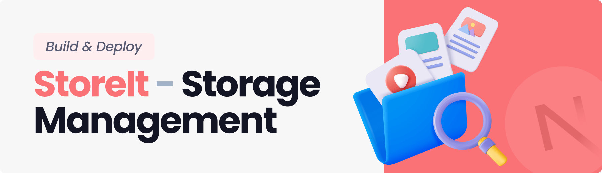

<div align="center">
  <br />
    <a href="https://youtu.be/lie0cr3wESQ" target="_blank">
      
    </a>
  <br />

  <div>
     
    
    
    
  </div>

<h3 align="center">Storage and File Sharing Platform</h3>

   <div align="center">
     Build this project step by step with our detailed tutorial on <a href="https://www.youtube.com/@javascriptmastery/videos" target="_blank"><b>JavaScript Mastery</b></a> YouTube. Join the JSM family!
    </div>
</div>

## 📋 <a name="table">Table of Contents</a>

1. 🤖 [Introduction](#introduction)
2. ⚙️ [Tech Stack](#tech-stack)
3. 🔋 [Features](#features)
4. 🤸 [Quick Start](#quick-start)
5. 🕸️ [Snippets (Code to Copy)](#snippets)
6. 🔗 [Assets](#links)
7. 🚀 [More](#more)

## 🚨 Tutorial

This repository contains the code corresponding to an in-depth tutorial available on our YouTube
channel, <a href="https://www.youtube.com/@javascriptmastery/videos" target="_blank"><b>JavaScript Mastery</b></a>.

If you prefer visual learning, this is the perfect resource for you. Follow our tutorial to learn how to build projects
like these step-by-step in a beginner-friendly manner!

<a href="https://youtu.be/lie0cr3wESQ?si=yLQyhMrYLjpysnqE" target="_blank"></a>

## <a name="introduction">🤖 Introduction</a>

A storage management and file sharing platform that lets users effortlessly upload, organize, and share files. Built with the latest Next.js 15 and the Appwrite Node SDK, utilizing advanced features for seamless file management.

If you're getting started and need assistance or face any bugs, join our active Discord community with over **34k+**
members. It's a place where people help each other out.

<a href="https://discord.com/invite/n6EdbFJ" target="_blank"></a>

## <a name="tech-stack">⚙️ Tech Stack</a>

- React 19
- Next.js 15
- Appwrite
- TailwindCSS
- ShadCN
- TypeScript

## <a name="features">🔋 Features</a>

👉 **User Authentication with Appwrite**: Implement signup, login, and logout functionality using Appwrite's authentication system.

👉 **FIle Uploads**: Effortlessly upload a variety of file types, including documents, images, videos, and audio, ensuring all your important data.

👉 **View and Manage Files**: Users can browse through their uploaded files stored in Appwrite storage, view on a new tab, rename file or delete.

👉 **Download Files**: Users can download their uploaded files giving them instant access to essential documents.

👉 **File Sharing**: Users can easily share their uploaded files with others, enabling collaboration and easy access to important content.

👉 **Dashboard**: Gain insights at a glance with a dynamic dashboard that showcases total and consumed storage, recent uploads, and a summary of files grouped by type.

👉 **Global Search**: Users can quickly find files and shared content across the platform with a robust global search feature.

👉 **Sorting Options**: Organize files efficiently by sorting them by date, name, or size, making file management a breeze.

👉 **Modern Responsive Design**: A fresh and minimalist UI that emphasizes usability, ensuring a clean aesthetic across all devices.

and many more, including the latest **React 19**, **Next.js 15** and **Appwrite** features alongside code architecture and
reusability

## <a name="quick-start">🤸 Quick Start</a>

Follow these steps to set up the project locally on your machine.

**Prerequisites**

Make sure you have the following installed on your machine:

- [Git](https://git-scm.com/)
- [Node.js](https://nodejs.org/en)
- [npm](https://www.npmjs.com/) (Node Package Manager)

**Cloning the Repository**

```bash
git clone https://github.com/JavaScript-Mastery-Pro/storage_management_solution.git
cd storage_management_solution
```

**Installation**

Install the project dependencies using npm:

```bash
npm install
```

**Set Up Environment Variables**

Create a new file named `.env.local` in the root of your project and add the following content:

```env
NEXT_PUBLIC_APPWRITE_ENDPOINT="https://cloud.appwrite.io/v1"
NEXT_PUBLIC_APPWRITE_PROJECT=""
NEXT_PUBLIC_APPWRITE_DATABASE=""
NEXT_PUBLIC_APPWRITE_USERS_COLLECTION=""
NEXT_PUBLIC_APPWRITE_FILES_COLLECTION=""
NEXT_PUBLIC_APPWRITE_BUCKET=""
NEXT_APPWRITE_KEY=""
```

Replace the values with your actual Appwrite credentials. You can obtain these credentials by signing up &
creating a new project on the [Appwrite website](https://appwrite.io/).

**Running the Project**

```bash
npm run dev
```

Open [http://localhost:3000](http://localhost:3000) in your browser to view the project.

## <a name="snippets">🕸️ Snippets</a>

<details>
<summary><code>tailwind.config.ts</code></summary>

```typescript
import type { Config } from 'tailwindcss';

const config: Config = {
  darkMode: ['class'],
  content: [
    './pages/**/*.{js,ts,jsx,tsx,mdx}',
    './components/**/*.{js,ts,jsx,tsx,mdx}',
    './app/**/*.{js,ts,jsx,tsx,mdx}',
  ],
  theme: {
    extend: {
      colors: {
        brand: {
          DEFAULT: '#FA7275',
          100: '#EA6365',
        },
        red: '#FF7474',
        error: '#b80000',
        green: '#3DD9B3',
        blue: '#56B8FF',
        pink: '#EEA8FD',
        orange: '#F9AB72',
        light: {
          100: '#333F4E',
          200: '#A3B2C7',
          300: '#F2F5F9',
          400: '#F2F4F8',
        },
        dark: {
          100: '#04050C',
          200: '#131524',
        },
      },
      fontFamily: {
        poppins: ['var(--font-poppins)'],
      },
      boxShadow: {
        'drop-1': '0px 10px 30px 0px rgba(66, 71, 97, 0.1)',
        'drop-2': '0 8px 30px 0 rgba(65, 89, 214, 0.3)',
        'drop-3': '0 8px 30px 0 rgba(65, 89, 214, 0.1)',
      },
      borderRadius: {
        lg: 'var(--radius)',
        md: 'calc(var(--radius) - 2px)',
        sm: 'calc(var(--radius) - 4px)',
      },
      keyframes: {
        'caret-blink': {
          '0%,70%,100%': { opacity: '1' },
          '20%,50%': { opacity: '0' },
        },
      },
      animation: {
        'caret-blink': 'caret-blink 1.25s ease-out infinite',
      },
    },
  },
  plugins: [require('tailwindcss-animate')],
};
export default config;
```

</details>

<details>
<summary><code>globals.css</code></summary>

```css
@tailwind base;
@tailwind components;
@tailwind utilities;

@layer base {
  * {
    @apply scroll-smooth;
  }

  body {
    @apply bg-white text-dark-200 min-h-screen;
  }

  .custom-scrollbar::-webkit-scrollbar {
    width: 6px;
    height: 3px;
    border-radius: 50px;
  }

  .custom-scrollbar::-webkit-scrollbar-track {
    background: transparent;
  }

  .custom-scrollbar::-webkit-scrollbar-thumb {
    background: #e5e7eb;
    border-radius: 50px;
  }

  .custom-scrollbar::-webkit-scrollbar-thumb:hover {
    background: #fa7275;
  }

  /* Remove scrollbar */
  .remove-scrollbar::-webkit-scrollbar {
    width: 0px;
    height: 0px;
    border-radius: 0px;
  }

  .remove-scrollbar::-webkit-scrollbar-track {
    background: transparent;
  }

  .remove-scrollbar::-webkit-scrollbar-thumb {
    background: transparent;
    border-radius: 0px;
  }

  .remove-scrollbar::-webkit-scrollbar-thumb:hover {
    /* background: #1e2238; */
    background: transparent;
  }

  .recharts-responsive-container {
    height: initial !important;
  }
}

@layer utilities {
  /* ===== TYPOGRAPHY */
  .h1 {
    @apply text-[34px] leading-[42px] font-bold;
  }
  .h2 {
    @apply text-[24px] leading-[36px] font-bold;
  }
  .h3 {
    @apply text-[20px] leading-[28px] font-semibold;
  }
  .h4 {
    @apply text-[18px] leading-[20px] font-medium;
  }
  .h5 {
    @apply text-[16px] leading-[24px] font-semibold;
  }
  .subtitle-1 {
    @apply text-[16px] leading-[24px] font-medium;
  }
  .subtitle-2 {
    @apply text-[14px] leading-[20px] font-semibold;
  }
  .body-1 {
    @apply text-[16px] leading-[24px] font-normal;
  }
  .body-2 {
    @apply text-[14px] leading-[20px] font-normal;
  }
  .button {
    @apply text-[14px] leading-[20px] font-medium;
  }
  .caption {
    @apply text-[12px] leading-[16px] font-normal;
  }
  .overline {
    @apply text-[10px] leading-[14px] font-normal;
  }

  /* ===== HELPER CLASSES */
  .container {
    @apply mx-auto max-w-7xl px-5;
  }
  .primary-btn {
    @apply bg-brand hover:bg-brand-100 transition-all rounded-full button !important;
  }
  .flex-center {
    @apply flex items-center justify-center;
  }

  /* =====  SHADCN OVERRIDES */
  .shad-no-focus {
    @apply outline-none ring-offset-transparent focus:ring-transparent focus:ring-offset-0 focus-visible:outline-none focus-visible:ring-0 focus-visible:ring-transparent focus-visible:ring-offset-0 !important;
  }
  .shad-input {
    @apply border-none shadow-none p-0 shad-no-focus placeholder:text-light-200 body-2 !important;
  }

  .shad-form-item {
    @apply flex h-[78px] flex-col justify-center rounded-xl border border-light-300 px-4 shadow-drop-1;
  }
  .shad-form-label {
    @apply text-light-100 pt-2 body-2 w-full !important;
  }
  .shad-form-message {
    @apply text-red body-2 ml-4 !important;
  }
  .shad-alert-dialog {
    @apply space-y-4 max-w-[95%] sm:w-fit rounded-xl md:rounded-[30px] px-4 md:px-8 py-10 bg-white outline-none !important;
  }
  .shad-submit-btn {
    @apply bg-brand button hover:bg-brand-100 transition-all rounded-full !important;
  }
  .shad-otp {
    @apply w-full flex gap-1 sm:gap-2 justify-between !important;
  }
  .shad-otp-slot {
    @apply text-[40px] font-medium rounded-xl ring-brand shadow-drop-1 text-brand-100 justify-center flex border-2 border-light-300 size-12 md:size-16 gap-5 !important;
  }

  .shad-sheet {
    @apply pt-0 !important;
  }
  .shad-sheet button,
  .shad-dialog button {
    @apply focus:ring-0 focus:ring-offset-0 focus-visible:border-none outline-none focus-visible:outline-none focus-visible:ring-transparent focus-visible:ring-offset-0 !important;
  }
  .shad-dropdown-item {
    @apply cursor-pointer !important;
  }
  .shad-dialog {
    @apply rounded-[26px] w-[90%] max-w-[400px] px-6 py-8   !important;
  }
  .shad-chart-title {
    @apply text-white !important;
  }
  .shad-select-item {
    @apply cursor-pointer !important;
  }

  /* Sidebar & MobileNavigation */
  .nav-icon {
    @apply w-6 filter invert opacity-25 !important;
  }
  .nav-icon-active {
    @apply invert-0 opacity-100 !important;
  }

  /* =====  STYLE CLASSES */

  /* Root Layout */
  .main-content {
    @apply remove-scrollbar h-full flex-1 overflow-auto bg-light-400 px-5 py-7 sm:mr-7 sm:rounded-[30px] md:mb-7 md:px-9 md:py-10 !important;
  }

  /* Dashboard */
  .dashboard-container {
    @apply mx-auto grid max-w-7xl grid-cols-1 gap-6 md:grid-cols-2 xl:gap-10 !important;
  }
  .dashboard-summary-list {
    @apply mt-6 grid grid-cols-1 gap-4 xl:mt-10 xl:grid-cols-2 xl:gap-9 !important;
  }
  .dashboard-summary-card {
    @apply relative mt-6 rounded-[20px] bg-white p-5 transition-all hover:scale-105 !important;
  }
  .summary-type-icon {
    @apply absolute -left-3 top-[-25px] z-10 w-[190px] object-contain !important;
  }
  .summary-type-size {
    @apply h4 relative z-20 w-full text-right !important;
  }
  .summary-type-title {
    @apply h5 relative z-20 text-center !important;
  }
  .dashboard-recent-files {
    @apply h-full rounded-[20px] xl:h-[654px] custom-scrollbar overflow-auto bg-white p-5 xl:p-7 !important;
  }
  .recent-file-details {
    @apply flex w-full justify-between items-center !important;
  }
  .recent-file-name {
    @apply subtitle-2 line-clamp-1 w-full text-light-100 sm:max-w-[200px] lg:max-w-[250px] !important;
  }
  .recent-file-date {
    @apply body-2 text-light-100/80 !important;
  }
  .empty-list {
    @apply body-1 mt-10 text-center text-light-200 !important;
  }

  /* Type page */
  .page-container {
    @apply mx-auto flex w-full max-w-7xl flex-col items-center gap-8 !important;
  }
  .total-size-section {
    @apply flex mt-2 flex-col justify-between sm:flex-row sm:items-center !important;
  }
  .file-list {
    @apply grid w-full gap-6 sm:grid-cols-2 lg:grid-cols-3 xl:grid-cols-4 !important;
  }
  .sort-container {
    @apply mt-5 flex items-center sm:mt-0 sm:gap-3 !important;
  }

  /* ActionsDropdown */
  .rename-input-field {
    @apply body-2 shad-no-focus h-[52px] w-full rounded-full border px-4 shadow-drop-1 !important;
  }
  .delete-confirmation {
    @apply text-center text-light-100 !important;
  }
  .delete-file-name {
    @apply font-medium text-brand-100 !important;
  }
  .modal-cancel-button {
    @apply h-[52px] flex-1 rounded-full bg-white text-light-100 hover:bg-transparent !important;
  }
  .modal-submit-button {
    @apply primary-btn !mx-0 h-[52px] w-full flex-1 !important;
  }

  /* ActionsModalContent */
  .file-details-thumbnail {
    @apply !mb-1 flex items-center gap-3 rounded-xl border border-light-200/40 bg-light-400/50 p-3 !important;
  }
  .file-details-label {
    @apply body-2 w-[30%] text-light-100 !important;
  }
  .file-details-value {
    @apply subtitle-2 flex-1 !important;
  }

  .share-wrapper {
    @apply !mt-2 space-y-2 !important;
  }
  .share-input-field {
    @apply body-2 shad-no-focus h-[52px] w-full rounded-full border px-4 shadow-drop-1 !important;
  }
  .share-remove-user {
    @apply rounded-full bg-transparent text-light-100 shadow-none hover:bg-transparent !important;
  }
  .remove-icon {
    @apply aspect-square rounded-full !important;
  }

  /* AuthForm */
  .auth-form {
    @apply flex max-h-[800px] w-full max-w-[580px] flex-col justify-center space-y-6 transition-all lg:h-full lg:space-y-8 !important;
  }
  .form-title {
    @apply h1 text-center text-light-100 md:text-left !important;
  }
  .form-submit-button {
    @apply primary-btn h-[66px] !important;
  }
  .error-message {
    @apply body-2 mx-auto w-fit rounded-xl bg-error/5 px-8 py-4 text-center text-error !important;
  }

  /* Card */
  .file-card {
    @apply flex cursor-pointer flex-col gap-6 rounded-[18px] bg-white p-5 shadow-sm transition-all hover:shadow-drop-3 !important;
  }
  .file-card-details {
    @apply flex flex-col gap-2 text-light-100 !important;
  }

  /* Chart */
  .chart {
    @apply flex items-center rounded-[20px] bg-brand p-2 text-white md:flex-col xl:flex-row !important;
  }
  .chart-container {
    @apply mx-auto aspect-square w-[180px] text-white xl:w-[200px] !important;
  }
  .polar-grid {
    @apply first:fill-white/20 last:fill-brand !important;
  }
  .chart-details {
    @apply flex-1 items-start px-3 py-0 sm:px-5 lg:p-3 xl:pr-5 !important;
  }
  .chart-total-percentage {
    @apply fill-white text-4xl font-bold !important;
  }
  .chart-title {
    @apply h3 font-bold md:text-center lg:text-left !important;
  }
  .chart-description {
    @apply subtitle-1 mt-2 w-full text-white/70 md:text-center lg:text-left !important;
  }

  /* FileUploader */
  .uploader-button {
    @apply primary-btn h-[52px] gap-2 px-10 shadow-drop-1 !important;
  }
  .uploader-preview-list {
    @apply fixed bottom-10 right-10 z-50 flex size-full h-fit max-w-[480px] flex-col gap-3 rounded-[20px] bg-white p-7 shadow-drop-3 !important;
  }
  .uploader-preview-item {
    @apply flex items-center justify-between  gap-3 rounded-xl p-3 shadow-drop-3 !important;
  }
  .preview-item-name {
    @apply subtitle-2 mb-2 line-clamp-1 max-w-[300px] !important;
  }

  .error-toast {
    @apply bg-red !rounded-[10px] !important;
  }

  /* Header */
  .header {
    @apply hidden items-center justify-between gap-5 p-5 sm:flex lg:py-7 xl:gap-10 !important;
  }
  .header-wrapper {
    @apply flex-center min-w-fit gap-4 !important;
  }
  .sign-out-button {
    @apply flex-center h-[52px] min-w-[54px] items-center rounded-full bg-brand/10 p-0 text-brand shadow-none transition-all hover:bg-brand/20 !important;
  }

  /* Mobile Navigation */
  .mobile-header {
    @apply flex h-[60px] justify-between px-5 sm:hidden !important;
  }
  .header-user {
    @apply my-3 flex items-center gap-2 rounded-full p-1 text-light-100 sm:justify-center sm:bg-brand/10 lg:justify-start lg:p-3 !important;
  }
  .header-user-avatar {
    @apply aspect-square w-10 rounded-full object-cover !important;
  }
  .mobile-nav {
    @apply h5 flex-1 gap-1 text-brand !important;
  }
  .mobile-nav-list {
    @apply flex flex-1 flex-col gap-4 !important;
  }
  .mobile-nav-item {
    @apply flex text-light-100 gap-4 w-full justify-start items-center h5 px-6 h-[52px] rounded-full !important;
  }
  .mobile-sign-out-button {
    @apply h5 flex h-[52px] w-full items-center gap-4 rounded-full bg-brand/10 px-6 text-brand shadow-none transition-all hover:bg-brand/20 !important;
  }

  /* OTP Modal */
  .otp-close-button {
    @apply absolute -right-1 -top-7 cursor-pointer sm:-right-2 sm:-top-4  !important;
  }

  /* Search */
  .search {
    @apply relative w-full md:max-w-[480px] !important;
  }
  .search-input-wrapper {
    @apply flex h-[52px] flex-1 items-center gap-3 rounded-full px-4 shadow-drop-3 !important;
  }
  .search-input {
    @apply body-2 shad-no-focus  placeholder:body-1 w-full border-none p-0 shadow-none placeholder:text-light-200 !important;
  }
  .search-result {
    @apply absolute left-0 top-16 z-50 flex w-full flex-col gap-3 rounded-[20px] bg-white p-4 !important;
  }
  .empty-result {
    @apply body-2 text-center text-light-100 !important;
  }

  /* Sidebar */
  .sidebar {
    @apply remove-scrollbar hidden h-screen w-[90px] flex-col overflow-auto px-5 py-7 sm:flex lg:w-[280px] xl:w-[325px] !important;
  }
  .sidebar-nav {
    @apply h5 mt-9 flex-1 gap-1 text-brand !important;
  }
  .sidebar-nav-item {
    @apply flex text-light-100 gap-4 rounded-xl lg:w-full justify-center lg:justify-start items-center h5 lg:px-[30px] h-[52px] lg:rounded-full !important;
  }
  .sidebar-user-info {
    @apply mt-4 flex items-center justify-center gap-2 rounded-full bg-brand/10 p-1 text-light-100 lg:justify-start lg:p-3 !important;
  }
  .sidebar-user-avatar {
    @apply aspect-square w-10 rounded-full object-cover !important;
  }

  .shad-active {
    @apply bg-brand text-white shadow-drop-2 !important;
  }

  /* Sort */
  .sort-select {
    @apply shad-no-focus h-11 w-full rounded-[8px] border-transparent bg-white !shadow-sm sm:w-[210px] !important;
  }
  .sort-select-content {
    @apply !shadow-drop-3 !important;
  }

  /* Thumbnail */
  .thumbnail {
    @apply flex-center size-[50px] min-w-[50px] overflow-hidden rounded-full bg-brand/10;
  }
  .thumbnail-image {
    @apply size-full object-cover object-center !important;
  }
}
```

</details>

<details>
<summary><code>constants/index.ts</code></summary>

```typescript
export const navItems = [
  {
    name: 'Dashboard',
    icon: '/assets/icons/dashboard.svg',
    url: '/',
  },
  {
    name: 'Documents',
    icon: '/assets/icons/documents.svg',
    url: '/documents',
  },
  {
    name: 'Images',
    icon: '/assets/icons/images.svg',
    url: '/images',
  },
  {
    name: 'Media',
    icon: '/assets/icons/video.svg',
    url: '/media',
  },
  {
    name: 'Others',
    icon: '/assets/icons/others.svg',
    url: '/others',
  },
];

export const actionsDropdownItems = [
  {
    label: 'Rename',
    icon: '/assets/icons/edit.svg',
    value: 'rename',
  },
  {
    label: 'Details',
    icon: '/assets/icons/info.svg',
    value: 'details',
  },
  {
    label: 'Share',
    icon: '/assets/icons/share.svg',
    value: 'share',
  },
  {
    label: 'Download',
    icon: '/assets/icons/download.svg',
    value: 'download',
  },
  {
    label: 'Delete',
    icon: '/assets/icons/delete.svg',
    value: 'delete',
  },
];

export const sortTypes = [
  {
    label: 'Date created (newest)',
    value: '$createdAt-desc',
  },
  {
    label: 'Created Date (oldest)',
    value: '$createdAt-asc',
  },
  {
    label: 'Name (A-Z)',
    value: 'name-asc',
  },
  {
    label: 'Name (Z-A)',
    value: 'name-desc',
  },
  {
    label: 'Size (Highest)',
    value: 'size-desc',
  },
  {
    label: 'Size (Lowest)',
    value: 'size-asc',
  },
];

export const MAX_FILE_SIZE = 50 * 1024 * 1024; // 50MB
```

</details>

<details>
<summary><code>lib/utils.ts</code></summary>

```typescript
import { clsx, type ClassValue } from 'clsx';
import { twMerge } from 'tailwind-merge';

export function cn(...inputs: ClassValue[]) {
  return twMerge(clsx(inputs));
}
export const parseStringify = (value: unknown) =>
  JSON.parse(JSON.stringify(value));

export const convertFileToUrl = (file: File) => URL.createObjectURL(file);

export const convertFileSize = (sizeInBytes: number, digits?: number) => {
  if (sizeInBytes < 1024) {
    return sizeInBytes + ' Bytes'; // Less than 1 KB, show in Bytes
  } else if (sizeInBytes < 1024 * 1024) {
    const sizeInKB = sizeInBytes / 1024;
    return sizeInKB.toFixed(digits || 1) + ' KB'; // Less than 1 MB, show in KB
  } else if (sizeInBytes < 1024 * 1024 * 1024) {
    const sizeInMB = sizeInBytes / (1024 * 1024);
    return sizeInMB.toFixed(digits || 1) + ' MB'; // Less than 1 GB, show in MB
  } else {
    const sizeInGB = sizeInBytes / (1024 * 1024 * 1024);
    return sizeInGB.toFixed(digits || 2) + ' GB'; // 1 GB or more, show in GB
  }
};

export const calculateAngle = (sizeInBytes: number) => {
  const totalSizeInBytes = 2 * 1024 * 1024 * 1024; // 2GB in bytes
  const percentage = (sizeInBytes / totalSizeInBytes) * 360;
  return Number(percentage.toFixed(2));
};

export const calculatePercentage = (sizeInBytes: number) => {
  const totalSizeInBytes = 2 * 1024 * 1024 * 1024; // 2GB in bytes
  const percentage = (sizeInBytes / totalSizeInBytes) * 100;
  return Number(percentage.toFixed(1));
};

export const getFileType = (fileName: string) => {
  const extension = fileName.split('.').pop()?.toLowerCase();

  if (!extension) return { type: 'other', extension: '' };

  const documentExtensions = [
    'pdf',
    'doc',
    'docx',
    'txt',
    'xls',
    'xlsx',
    'csv',
    'rtf',
    'ods',
    'ppt',
    'odp',
    'md',
    'html',
    'htm',
    'epub',
    'pages',
    'fig',
    'psd',
    'ai',
    'indd',
    'xd',
    'sketch',
    'afdesign',
    'afphoto',
    'afphoto',
  ];
  const imageExtensions = ['jpg', 'jpeg', 'png', 'gif', 'bmp', 'svg', 'webp'];
  const videoExtensions = ['mp4', 'avi', 'mov', 'mkv', 'webm'];
  const audioExtensions = ['mp3', 'wav', 'ogg', 'flac'];

  if (documentExtensions.includes(extension))
    return { type: 'document', extension };
  if (imageExtensions.includes(extension)) return { type: 'image', extension };
  if (videoExtensions.includes(extension)) return { type: 'video', extension };
  if (audioExtensions.includes(extension)) return { type: 'audio', extension };

  return { type: 'other', extension };
};

export const formatDateTime = (isoString: string | null | undefined) => {
  if (!isoString) return '—';

  const date = new Date(isoString);

  // Get hours and adjust for 12-hour format
  let hours = date.getHours();
  const minutes = date.getMinutes();
  const period = hours >= 12 ? 'pm' : 'am';

  // Convert hours to 12-hour format
  hours = hours % 12 || 12;

  // Format the time and date parts
  const time = `${hours}:${minutes.toString().padStart(2, '0')}${period}`;
  const day = date.getDate();
  const monthNames = [
    'Jan',
    'Feb',
    'Mar',
    'Apr',
    'May',
    'Jun',
    'Jul',
    'Aug',
    'Sep',
    'Oct',
    'Nov',
    'Dec',
  ];
  const month = monthNames[date.getMonth()];

  return `${time}, ${day} ${month}`;
};

export const getFileIcon = (
  extension: string | undefined,
  type: FileType | string,
) => {
  switch (extension) {
    // Document
    case 'pdf':
      return '/assets/icons/file-pdf.svg';
    case 'doc':
      return '/assets/icons/file-doc.svg';
    case 'docx':
      return '/assets/icons/file-docx.svg';
    case 'csv':
      return '/assets/icons/file-csv.svg';
    case 'txt':
      return '/assets/icons/file-txt.svg';
    case 'xls':
    case 'xlsx':
      return '/assets/icons/file-document.svg';
    // Image
    case 'svg':
      return '/assets/icons/file-image.svg';
    // Video
    case 'mkv':
    case 'mov':
    case 'avi':
    case 'wmv':
    case 'mp4':
    case 'flv':
    case 'webm':
    case 'm4v':
    case '3gp':
      return '/assets/icons/file-video.svg';
    // Audio
    case 'mp3':
    case 'mpeg':
    case 'wav':
    case 'aac':
    case 'flac':
    case 'ogg':
    case 'wma':
    case 'm4a':
    case 'aiff':
    case 'alac':
      return '/assets/icons/file-audio.svg';

    default:
      switch (type) {
        case 'image':
          return '/assets/icons/file-image.svg';
        case 'document':
          return '/assets/icons/file-document.svg';
        case 'video':
          return '/assets/icons/file-video.svg';
        case 'audio':
          return '/assets/icons/file-audio.svg';
        default:
          return '/assets/icons/file-other.svg';
      }
  }
};

// APPWRITE URL UTILS
// Construct appwrite file URL - https://appwrite.io/docs/apis/rest#images
export const constructFileUrl = (bucketFileId: string) => {
  return `${process.env.NEXT_PUBLIC_APPWRITE_ENDPOINT}/storage/buckets/${process.env.NEXT_PUBLIC_APPWRITE_BUCKET}/files/${bucketFileId}/view?project=${process.env.NEXT_PUBLIC_APPWRITE_PROJECT}`;
};

export const constructDownloadUrl = (bucketFileId: string) => {
  return `${process.env.NEXT_PUBLIC_APPWRITE_ENDPOINT}/storage/buckets/${process.env.NEXT_PUBLIC_APPWRITE_BUCKET}/files/${bucketFileId}/download?project=${process.env.NEXT_PUBLIC_APPWRITE_PROJECT}`;
};

// DASHBOARD UTILS
export const getUsageSummary = (totalSpace: any) => {
  return [
    {
      title: 'Documents',
      size: totalSpace.document.size,
      latestDate: totalSpace.document.latestDate,
      icon: '/assets/icons/file-document-light.svg',
      url: '/documents',
    },
    {
      title: 'Images',
      size: totalSpace.image.size,
      latestDate: totalSpace.image.latestDate,
      icon: '/assets/icons/file-image-light.svg',
      url: '/images',
    },
    {
      title: 'Media',
      size: totalSpace.video.size + totalSpace.audio.size,
      latestDate:
        totalSpace.video.latestDate > totalSpace.audio.latestDate
          ? totalSpace.video.latestDate
          : totalSpace.audio.latestDate,
      icon: '/assets/icons/file-video-light.svg',
      url: '/media',
    },
    {
      title: 'Others',
      size: totalSpace.other.size,
      latestDate: totalSpace.other.latestDate,
      icon: '/assets/icons/file-other-light.svg',
      url: '/others',
    },
  ];
};

export const getFileTypesParams = (type: string) => {
  switch (type) {
    case 'documents':
      return ['document'];
    case 'images':
      return ['image'];
    case 'media':
      return ['video', 'audio'];
    case 'others':
      return ['other'];
    default:
      return ['document'];
  }
};
```

</details>

<details>
<summary><code>index.d.ts</code></summary>

```ts
/* eslint-disable no-unused-vars */

declare type FileType = 'document' | 'image' | 'video' | 'audio' | 'other';

declare interface ActionType {
  label: string;
  icon: string;
  value: string;
}

declare interface SearchParamProps {
  params?: Promise<SegmentParams>;
  searchParams?: Promise<{ [key: string]: string | string[] | undefined }>;
}

declare interface UploadFileProps {
  file: File;
  ownerId: string;
  accountId: string;
  path: string;
}
declare interface GetFilesProps {
  types: FileType[];
  searchText?: string;
  sort?: string;
  limit?: number;
}
declare interface RenameFileProps {
  fileId: string;
  name: string;
  extension: string;
  path: string;
}
declare interface UpdateFileUsersProps {
  fileId: string;
  emails: string[];
  path: string;
}
declare interface DeleteFileProps {
  fileId: string;
  bucketFileId: string;
  path: string;
}

declare interface FileUploaderProps {
  ownerId: string;
  accountId: string;
  className?: string;
}

declare interface MobileNavigationProps {
  ownerId: string;
  accountId: string;
  fullName: string;
  avatar: string;
  email: string;
}
declare interface SidebarProps {
  fullName: string;
  avatar: string;
  email: string;
}

declare interface ThumbnailProps {
  type: string;
  extension: string;
  url: string;
  className?: string;
  imageClassName?: string;
}

declare interface ShareInputProps {
  file: Models.Document;
  onInputChange: (e: React.ChangeEvent<HTMLInputElement>) => void;
  onRemove: (email: string) => void;
}
```

</details>

## <a name="links">🔗 Assets</a>

- Assets used in the project can be found [here](https://jsm.dev/gdrive-kit)

<a href="https://jsm.dev/gdrive-kit">
  
</a>


## <a name="more">🚀 More</a>

**Advance your skills with Next.js Pro Course**

Enjoyed creating this project? Dive deeper into our PRO courses for a richer learning adventure. They're packed with
detailed explanations, cool features, and exercises to boost your skills. Give it a go!

<a href="https://jsm.dev/gdrive-jsmpro" target="_blank">
  
</a>